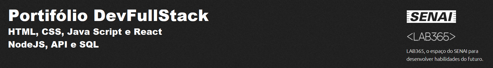

### Projeto do exercícios da semanas 6. PostgresSQL e SQL com DBeaver


Para utilizar este projeto como base, faça o seguinte passo-a-passo:

- Clone o projeto para a sua máquina

```bash
https://github.com/EricoCoutoJr/M2S06-EX2.git
```

Obs: necessário configurar SSH [(veja como clicando aqui)](https://www.youtube.com/watch?v=n-H1eFSsugo)

- Instale as dependências (lembre-se de acessar a pasta correta no terminal)

```bash
npm install
```

- Rode o projeto

```bash
npm run dev
```

### Observações

Serão usadas a seguinte dependên:

- express
